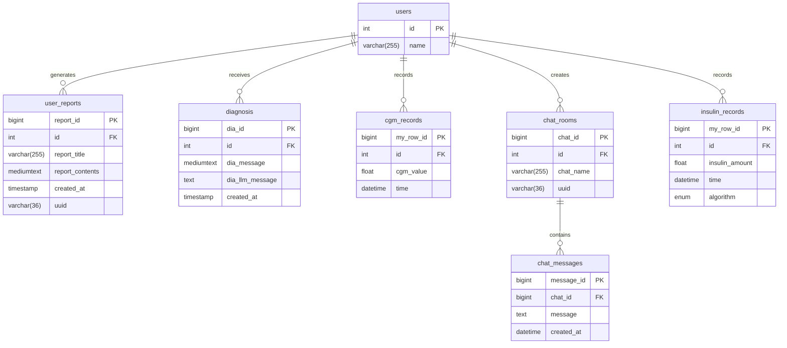

# GlucoBeat Project

SW융합대학 디지털 경진대회 최종 출품작

## 목차
- [시스템 요구사항](#시스템-요구사항)
- [프로젝트 다운로드](#프로젝트-다운로드)
- [패키지 설치](#패키지-설치)
- [Python 가상환경 설정](#python-가상환경-설정)
- [환경 변수 설정](#환경-변수-설정)
- [데이터베이스 구조](#데이터베이스-구조)
- [프로젝트 실행](#프로젝트-실행)

## 시스템 요구사항

### 필수 프로그램 (Windows, Mac, Linux)
- **Git** 
- **Python 3.10.11**
- **Python 3.12.10** 
- **Node.js 22.14.0**

### 환경변수 설정 확인

프로그램 설치 후 터미널/명령 프롬프트에서 다음 명령어로 정상 설치를 확인해주세요:

```bash
# 버전 확인
git --version

# Python 버전 확인 (Windows)
py -3.10 --version
py -3.12 --version

# Python 버전 확인 (Mac/Linux)
python3.10 --version  # 또는 python3 --version
python3.12 --version

# Node.js 확인
node --version
npm --version
```

**주의사항**: 
- 설치 시 "Add to PATH" 옵션을 체크하거나, 수동으로 환경변수 PATH에 추가해야 합니다.

## 프로젝트 다운로드

### Git 설치

**Windows:**
- [Git for Windows](https://git-scm.com/download/win) 다운로드 및 설치

**Mac:**
```bash
# Homebrew가 설치되어 있다면
brew install git

# 또는 Xcode Command Line Tools
xcode-select --install
```

**Linux (Ubuntu/Debian):**
```bash
sudo apt update
sudo apt install git
```

**Linux (CentOS/RHEL):**
```bash
sudo yum install git
```

### 프로젝트 클론

```bash
git clone https://github.com/GlucoBeatProject/GlucoBeatProject.git
cd GlucoBeatProject
```

## 패키지 설치

### Node.js 패키지

#### 1. algo-oref0/oref0 폴더
```bash
cd algo-oref0/oref0
npm install
npm install express
```

#### 2. frontend 폴더
```bash
cd frontend
npm install
```

## Python 가상환경 설정

### Windows 환경
```bash
cd scripts/windows
./run_setup.bat
```

### Mac/Linux 환경

#### 1단계: Backend/MCP 서버용 가상환경 (Python 3.12.10)
```bash
# 가상환경 생성 및 활성화
python3.12 -m venv backend_env
source backend_env/bin/activate  # Mac/Linux

# 패키지 설치
cd scripts
pip install -r backend_mcp_requirement.txt
```

#### 2단계: Simglucose/G2P2C용 가상환경 (Python 3.10.11)
```bash
# 가상환경 생성 및 활성화
python3.10 -m venv simglucose_env
source simglucose_env/bin/activate  # Mac/Linux

# 패키지 설치
cd scripts
pip install -r simglucose_g2p2c_requirement.txt
```

## 환경 변수 설정

### Backend Orchestrator 환경 변수

`backend-orchestrator` 폴더에 `.env` 파일을 생성하고 다음 정보를 입력해주세요:

```env
# 데이터베이스 설정
DB_HOST=your_database_host
DB_PORT=your_database_port
DB_NAME=your_database_name
DB_USER=your_database_user
DB_PASSWORD=your_database_password

# LLM API 설정
ANTHROPIC_API_KEY=your_anthropic_api_key
# 또는 다른 LLM 서비스 API KEY
OPENAI_API_KEY=your_openai_api_key
GEMINI_API_KEY=your_gemini_api_key

# 기타 설정
ENVIRONMENT=development
DEBUG=true
```

**주의사항**: 실제 API 키와 데이터베이스 정보를 입력하세요. `.env` 파일은 절대 버전 관리(Git)에 포함하지 마세요.

## 데이터베이스 구조

### ERD (Entity Relationship Diagram)



### 테이블 설명

- **users**: 사용자 기본 정보
- **user_reports**: 사용자 생성 리포트
- **diagnosis**: 진단 내역
- **cgm_records**: 혈당 측정 기록
- **chat_rooms**: 채팅방 정보
- **insulin_records**: 인슐린 투여 기록
- **chat_messages**: 채팅 메시지

## 프로젝트 실행

### Windows 환경 (간단 실행)

#### Simglucose 시뮬레이션
```bash
cd scripts/windows
./run_simulation.bat
# 1번 입력: 식사 입력 없는 랜덤 시나리오
# 2번 입력: 식사 입력 있는 커스텀 시나리오
# 마지막에 띄워지는 Simglucose 터미널에서 1번, 2번 중 선택
```

#### Web 프로젝트
```bash
cd scripts/windows
./run_web.bat
```

### 전체 환경 (Windows, Mac, Linux)

#### 1. Simglucose 시뮬레이션 실행

**터미널 1**: Backend Orchestrator
```bash
# backend_mcp_requirement.txt 가상환경 활성화
cd backend-orchestrator
python main.py
```

**터미널 2**: MCP Database Server
```bash
cd mcp-db-server
python main.py
```

**터미널 3**: Node.js Server
```bash
cd algo-oref0/oref0
node server.js
```

**터미널 4**: ML G2P2C
```bash
# 기존 가상환경 deactivate 후
# simglucose_g2p2c_requirement.txt 가상환경 활성화
cd ml-g2p2c
python main.py
```

**터미널 5**: Simglucose 실행
```bash
cd simglucose/simglucose
# 기본 설정으로 실행
python run_simulation_programmatic.py
# 1번 입력: 식사 입력 없는 랜덤 시나리오
# 2번 입력: 식사 입력 있는 커스텀 시나리오
# 마지막에 띄워지는 Simglucose 터미널에서 1번, 2번 중 선택

# 또는 커스텀 설정으로 실행
python run_simulation.py
# 터미널에 주어지는 질문들을 통해 커스텀 설정 가능
```

#### 2. Web 프로젝트 실행

**터미널 1**: Backend Orchestrator
```bash
# backend_mcp_requirement.txt 가상환경 활성화
cd backend-orchestrator
python main.py
```

**터미널 2**: MCP Database Server
```bash
cd mcp-db-server
python main.py
```

**터미널 3**: Frontend Server
```bash
cd frontend
npm run dev
```

**접속**: http://localhost:3000

## 참고사항

- **기본 시뮬레이터**: 환자, 식사 등이 미리 설정되어 있음
- **커스텀 시뮬레이터**: 직접 설정 가능
- **가상환경**: 각 구성요소별로 다른 Python 버전 필요

